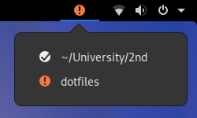
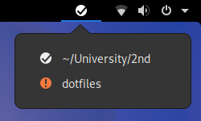

# Git Indicator

Indicates whether or not there are local changes to Git repositories.

## Screenshots

### Single repository


1. Clean working tree, nothing to commit
2. Local changes

### Multiple repositories & Popup menu

You can configure multiple repositories.
If there's at least one with local changes, you'll see the warning icon on the panel as well:



## Installation

```console
$ git clone https://github.com/operrathor/gnome-shell-git-indicator.git ~/.local/share/gnome-shell/extensions/git-indicator@operrathor.net
$ touch ~/.local/share/gnome-shell/extensions/git-indicator@operrathor.net/repositories.json
```

Afterwards, restart Gnome Shell and enable the extension via `gnome-shell-extension-prefs` or Tweaks.

Proceed with configuration.

## Configuration

### Steps

1. Update `~/.local/share/gnome-shell/extensions/git-indicator@operrathor.net/repositories.json` (see options and example below)
2. Restart GNOME Shell

### Options

* (mandatory) `gitDir`: Absolute path to the repository (".git" directory)
* (mandatory) `workTree`: Absolute path to the working tree
* (optional) `name`: Name shown in the popup menu (if left empty, `gitDir` is shown)
* (optional) `noWarning`: If set to true, the repository won't cause a warning icon to be shown on the panel (default is false)

### Example

`repositories.json`:
```json
[
    {
        "gitDir": "/home/operrathor/University/2nd/.git",
        "workTree": "/home/operrathor/University/2nd",
        "name": "~/University/2nd"
    },
    {
        "gitDir": "/home/operrathor/.dotfiles",
        "workTree": "/home/operrathor",
        "name": "dotfiles",
        "noWarning": true
    }
]
```

Since `noWarning` is set on the `dotfiles` repository, changes to this repository alone won't cause a warning icon to be shown on the panel:



Also note that `dotfiles`' `gitDir` doesn't point to a `.git` directory as it's a bare Git repository.

## How it works

If the output of `git status -s` is empty, the working tree seems to be clean and there's obviously nothing to commit.

## Limitations

* Repository configuration only via JSON
* Change of configuration requires restart of GNOME Shell
* Icons depend on selected icon theme
